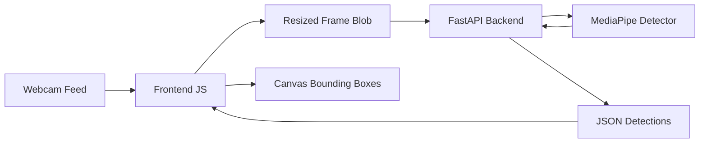

# VisionX: Real-Time AI Object Detection 👁️🚀

VisionX is a high-performance, professional-grade real-time object detection web application. Built with **FastAPI** on the backend and **Vanilla JavaScript** on the frontend, it leverages **TensorFlow** pre-trained models to detect, label, and track objects from a live webcam feed with low latency.


## 🌟 Key Features

- **Real-Time Detection**: Sub-100ms inference using optimized SSD MobileNet V2.
- **Dynamic Visualization**: Smooth bounding box rendering on HTML5 Canvas.
- **Advanced Controls**:
  - Live Confidence Threshold adjustment.
  - Object count tracking.
  - FPS (Frames Per Second) counter.
  - Toggle switch for enabling/disabling detection.
- **Modern UI**: Dark-themed, glassmorphic interface designed for clarity and aesthetics.
- **Production-Ready Backend**: Scalable FastAPI implementation with model warm-up and error handling.
- **Screenshot Module**: Capture and download detection results instantly.

## 🛠️ Tech Stack

- **Backend**: Python 3.9+, FastAPI, MediaPipe, OpenCV
- **Frontend**: HTML5, CSS3 (Vanilla), JavaScript (ES6+), Canvas API
- **AI Model**: EfficientDet-Lite0 (MediaPipe Task API)
- **Deployment**: Uvicorn (ASGI Server)

## 🏗️ Architecture



1. **Frame Capture**: Browser accesses webcam via `getUserMedia`.
2. **Preprocessing**: Frames are resized to 320px width locally before transmission to reduce bandwidth and latency.
3. **Inference**: FastAPI receives the frame, runs it through the SSD model, and filters results by the user-defined threshold.
4. **Rendering**: Predictions are sent back as JSON and drawn dynamically over the video feed.

## 🚀 Getting Started

### 1. Clone the repository
```bash
git clone https://github.com/yourusername/VisionX.git
cd VisionX
```

### 2. Install Dependencies
```bash
pip install -r requirements.txt
```

### 3. Run the Backend
```bash
python -m backend.app
```
*The server will start at `http://localhost:8000`*

### 4. Launch the Frontend
Open `frontend/index.html` in any modern web browser.

## 📁 Project Structure

```text
VisionX/
├── backend/
│   ├── app.py           # FastAPI entry point
│   ├── detector.py      # Inference logic
│   └── model_loader.py  # TF-Hub model handler
├── frontend/
│   ├── index.html       # UI Structure
│   ├── style.css        # Premium Design
│   └── script.js        # Webcam & API logic
├── model/               # Model storage
└── requirements.txt     # Python dependencies
```

## 🔮 Future Improvements

- [ ] **Multi-Model Support**: Add a dropdown to switch between YOLOv8, EfficientDet, and Faster R-CNN.
- [ ] **Batch Processing**: Support for video file uploads and batch frame analysis.
- [ ] **Cloud Integration**: AWS Lambda/GCP Cloud Run deployment wrappers.
- [ ] **PWA Support**: Make VisionX an installable Progressive Web App for mobile usage.

## 📜 License

Distributed under the MIT License. See `LICENSE` for more information.

---
**VisionX** was crafted with ❤️ by an AI Engineer.
